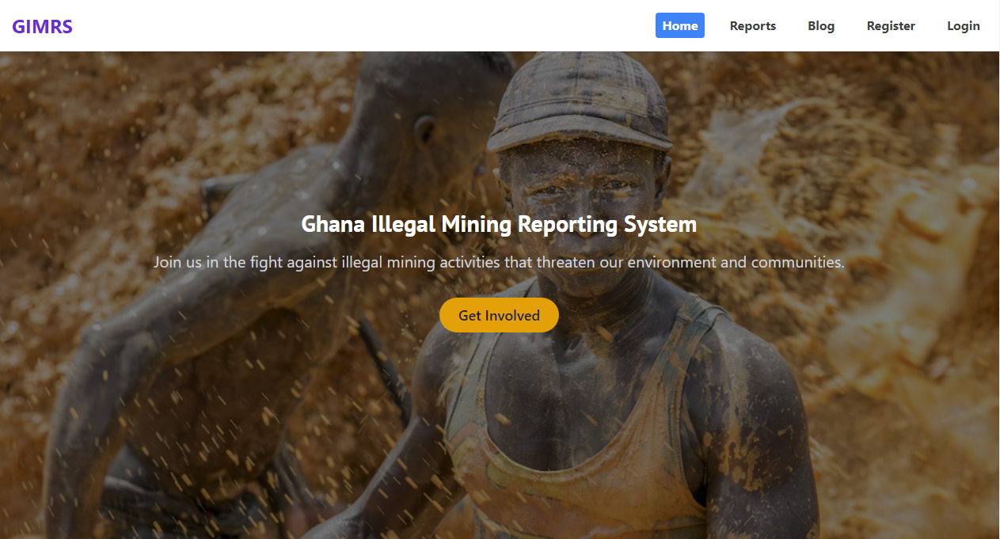

# Ghana Illegal Mining Reporting System Web App

## Homepage


## Access the Live Version
You can access the live version of the Ghana Illegal Mining Reporting System Web App at [Illegal Mining Reporting System](https://illegal-mining-report.vercel.app/)

## Overview
This Django application allows users to report illegal mining activities, view educational content, and read blog posts related to mining issues. It features user registration, login/logout functionality, and the ability to submit, edit, and delete reports. The app is designed to educate the public on the impact of illegal mining on the environment and communities.

## Features
- User authentication (registration, login, logout)
- Submit and manage reports of illegal mining activities
- View reports in a list format
- Detailed view of individual reports
- Edit and delete reports
- Educational content related to illegal mining
- Blog section for sharing articles and insights
- Search functionality for reports

## Technologies Used
- Django
- Python
- SQLite (or MySQL)
- HTML/CSS (with Tailwind CSS for styling)
- JavaScript (for any interactivity)

## Setup Instructions

### Prerequisites
- Python 3.x
- Django installed (`pip install django`)
- Any other dependencies as specified in `requirements.txt`

### Installation
1. Clone the repository:
   ```bash
   https://github.com/oRocket/Ghana_illegal_mining_report_system.git
   cd Ghana_illegal_mining_report_system.git

2. pip install -r requirements.txt

3. python manage.py migrate

4. python manage.py createsuperuser

5. python manage.py runserver

6. Access the application in your web browser at `http://127.0.0.1:8000/`

## Usage
- Register a new account to report illegal mining activities.
- Login to submit, edit, or delete reports.
- View educational articles and blog posts in the respective sections.

## Contributing
Contributions are welcome! Please create a pull request or open an issue if you have suggestions or improvements.

## License
This project is licensed under the MIT License. See the LICENSE file for details.

## Acknowledgments
- Thanks to the Django community for their extensive documentation and support.
- Special thanks to everyone who contributed to the development of this project.

## Pitch Deck
- For more information, view the pitch deck [here](https://gamma.app/docs/Ghana-Illegal-Mining-Reporting-System-xc8q3wcc91ektxh).

## Author
Albert Opoku-Twumasi
- [GitHub Profile](https://github.com/oRocket)
- [Email](mailto:aotwum.at@outlook.com)
- [LinkedIn](https://www.linkedin.com/in/https://www.linkedin.com/in/albert-opoku-twumasi-a4694b280/)
- [WhatsApp](https://wa.me/233501378473)
- [Discord](https://discord.com/users/1116822197038755951)
- [Twitter](https://twitter.com/Albert_O_T)

